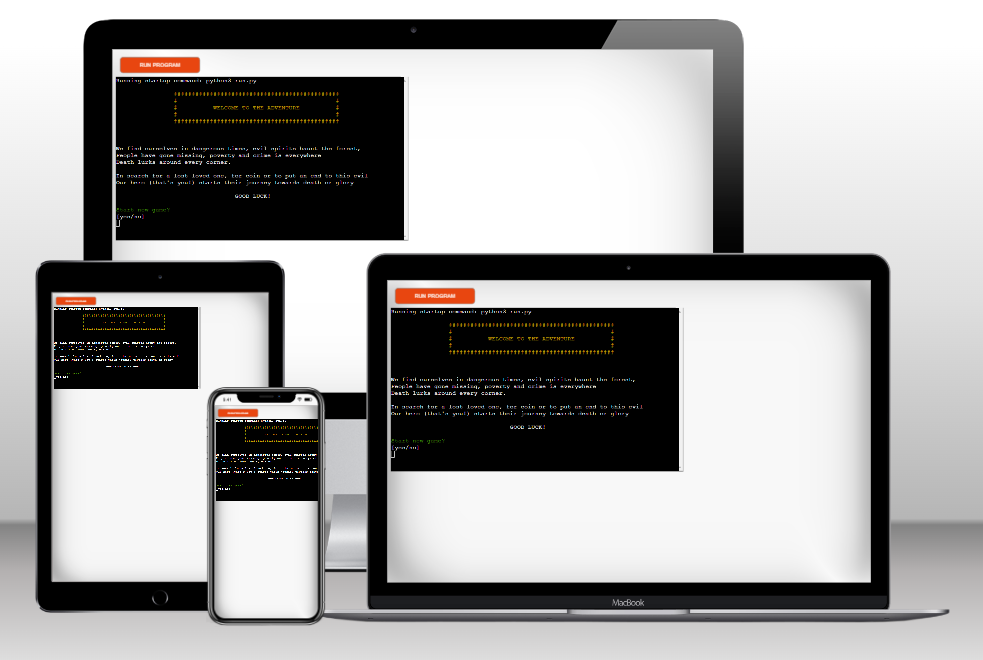
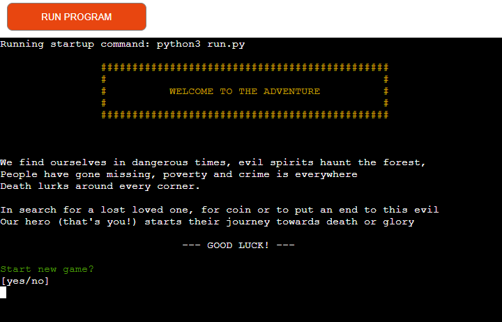
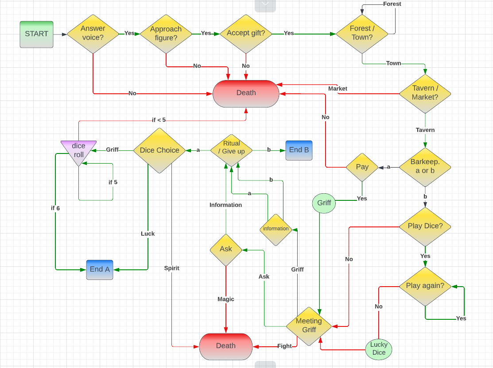

# Text Adventure Game
This is a text-based choose-your-own-adventure game running in the terminal.  
Players get to make decisions in the game by typing in their answers, each answer leading to a different outcome.  
  
## Features  

+ Game Start  
When the programme is run, the intro screen shows, welcoming the player and ask them if they would like to play.  
  
Followed by a request for the player to enter their name.  
  
After that the game starts to tell the story and asking the players to make choices. Each answer will lead to a different outcome. Some choices makes the game progress and some ends in a game over. The game over screen asks the player if they want to restart.  
  
+ Dice mini game  
Depending on the players choices, they might end up getting to play dice in a mini game halfway through the story.  
  
+ The End  
If the player manages to reach one of the endings they will be given a 'thank you for playing' message and the option to play again.  
+ Choices  
There's plenty of choices that changes how to story goes and depend on previous choices. There is two key elements that will affect the story depending on the players choices. The lucky dice and how you are introduced to Griff.  
### Road Map  
  
____
### Future Features  
Future features might include a more fleshed out dice mini game, with score. Also a health / life system to make the game more forgiving, smoother transitions and general improvements.  

## Testing  
*Tests included but are not limited to:*  
+ Playing through the game several times:  
    + Making the wrong decisions  
    + Making the wrong inputs  
    + Making the right inputs
    + Making the right decisions 
    + (table to be added)
+ Tested both in Gitpods terminal and the mock up terminal on Heroku. Also did additional testing in PyCharm.

### Validation
+ The code goes through the [PEP8 Checker](http://pep8online.com/) without any issues.  

## Bugs  
### Fixed bugs:  
+ While going through the game, making certain decisions in a certain order would leave the while loop of the dice game open, resulting in parts of the game jumping in where it shouldn't have. I fixed the issue by adding a variable and setting it to a boolean value depending on input, making the loop stop correctly when the player chooses to stop playing.  
### Unfixed bugs:  
+ There is no currently known bugs left unfixed.  

## Deployment  
This project was deployed onto Heroku. I did that by:  
1. 
