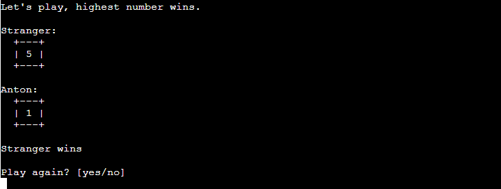

# Text Adventure Game
This is a text-based choose-your-own-adventure game running in the terminal.  
Players get to make decisions in the game by typing in their answers, each answer leading to a different outcome.  
  
## Features  

+ Game Start  
When the programme is run, the intro screen shows, welcoming the player and ask them if they would like to play.  
  
Followed by a request for the player to enter their name.  
  
After that the game starts to tell the story and asking the players to make choices. Each answer will lead to a different outcome. Some choices makes the game progress and some ends in a game over. The game over screen asks the player if they want to restart.  
  
+ Dice mini game  
Depending on the players choices, they might end up getting to play dice in a mini game halfway through the story.  
  
+ The End  
If the player manages to reach one of the endings they will be given a 'thank you for playing' message and the option to play again.